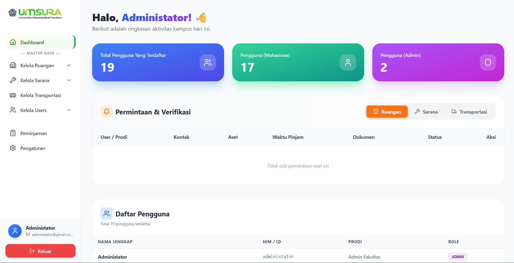
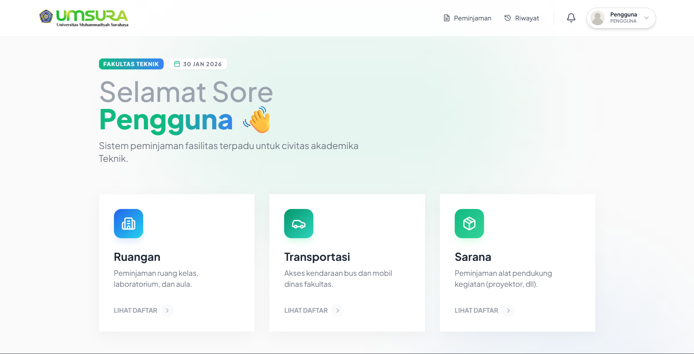

# 📦 Sistem Informasi Inventori Fakultas Teknik UMSurabaya

<div align="center">
  
  
  
  
  
  
</div>

## 📋 Deskripsi

Sistem Informasi Inventori Fakultas Teknik adalah platform manajemen inventaris modern yang dirancang khusus untuk Fakultas Teknik Universitas Muhammadiyah Surabaya. Sistem ini memudahkan pengelolaan aset, peminjaman sarana dan prasarana, serta monitoring inventaris secara real-time.

## ✨ Fitur Utama

### 👨‍💼 Panel Admin
- **Dashboard Analytics** - Monitoring data inventaris dengan visualisasi grafik
- **Manajemen Gedung & Ruangan** - Kelola data gedung dan ruangan fakultas
- **Manajemen Sarana Prasarana** - Pencatatan dan monitoring sarana lab dan transportasi
- **Kelola Peminjaman** - Verifikasi dan approval peminjaman aset
- **Manajemen User** - Kelola akun pengguna dan hak akses
- **Manajemen Program Studi** - Data program studi dan jurusan
- **Export Data** - Export laporan ke Excel dan PDF
- **Import User** - Import data pengguna dalam jumlah besar
- **Pengaturan Sistem** - Konfigurasi email, notifikasi, dan sistem

### 👤 Panel User
- **Dashboard Personal** - Informasi peminjaman dan notifikasi
- **Peminjaman Ruangan** - Request peminjaman ruangan dengan jadwal
- **Peminjaman Sarana Lab** - Pinjam alat dan bahan laboratorium
- **Peminjaman Transportasi** - Request kendaraan operasional
- **Riwayat Peminjaman** - Tracking status peminjaman
- **Profile Management** - Update informasi profil
- **Notifikasi Real-time** - Pemberitahuan status peminjaman

### 🔒 Keamanan
- Autentikasi berbasis session
- Password hashing dengan bcrypt
- Forgot password dengan email verification
- Role-based access control (Admin & User)
- CSRF protection

## 🛠️ Teknologi yang Digunakan

- **Backend**: PHP 7.4+
- **Database**: MySQL 5.7+
- **Frontend**: HTML5, TailwindCSS, JavaScript
- **Icons**: Lucide Icons
- **Email**: PHPMailer
- **Additional Libraries**: 
  - PDO untuk database connection
  - PHPMailer untuk email notifications

## 📁 Struktur Direktori

```
ft/
├── admin/                  # Panel administrasi
│   ├── dashboard.php       # Dashboard admin
│   ├── gedung.php          # Manajemen gedung
│   ├── ruangan.php         # Manajemen ruangan
│   ├── sarana.php          # Manajemen sarana
│   ├── transportasi.php    # Manajemen transportasi
│   ├── peminjaman.php      # Manajemen peminjaman
│   ├── kelola_user.php     # Manajemen user
│   ├── kelola_prodi.php    # Manajemen program studi
│   ├── pengaturan.php      # Pengaturan sistem
│   └── ...
├── user/                   # Panel pengguna
│   ├── dashboard.php       # Dashboard user
│   ├── peminjaman_ruangan.php
│   ├── peminjaman_sarana.php
│   ├── peminjaman_transportasi.php
│   ├── peminjaman_saya.php
│   ├── riwayat_peminjaman.php
│   └── profile.php
├── auth/                   # Authentication
│   ├── login_process.php
│   ├── logout.php
│   ├── forgot_password_process.php
│   └── reset_password_process.php
├── config/                 # Konfigurasi
│   ├── database.php        # Koneksi database
│   └── email_config.php    # Konfigurasi email
├── components/             # Komponen reusable
│   ├── AdminNavbar.php
│   ├── UserNavbar.php
│   └── Footer.php
├── assets/                 # Assets (images, css, js)
├── uploads/                # Upload files
│   ├── surat/             # Surat peminjaman
│   ├── pengembalian/      # Bukti pengembalian
│   └── templates/         # Template dokumen
├── vendor/                 # Third-party libraries
│   └── PHPMailer/
├── index.html              # Landing page
├── login.html              # Login page
├── forgot-password.html    # Forgot password page
├── reset-password.html     # Reset password page
└── panduan.php            # User guide
```

## 🚀 Instalasi

### Prasyarat
- PHP 7.4 atau lebih tinggi
- MySQL 5.7 atau lebih tinggi
- Web server (Apache/Nginx)
- Composer (opsional)

### Langkah Instalasi

1. **Clone Repository**
   ```bash
   git clone https://github.com/username/sistem-inventori-ft.git
   cd sistem-inventori-ft
   ```

2. **Buat Database**
   ```sql
   CREATE DATABASE inventory CHARACTER SET utf8mb4 COLLATE utf8mb4_unicode_ci;
   ```

3. **Import Database**
   - Import file SQL yang tersedia (jika ada) atau buat struktur tabel sesuai kebutuhan

4. **Konfigurasi Database**
   
   Edit file `config/database.php`:
   ```php
   $host = "localhost";
   $db   = "inventory";
   $user = "root";
   $pass = "your_password";
   ```

5. **Konfigurasi Email**
   
   Edit file `config/email_config.php` dengan kredensial SMTP Anda:
   ```php
   $smtp_host = 'smtp.gmail.com';
   $smtp_user = 'your_email@gmail.com';
   $smtp_pass = 'your_app_password';
   ```

6. **Set Permissions**
   ```bash
   chmod -R 755 uploads/
   chmod -R 755 vendor/
   ```

7. **Akses Aplikasi**
   
   Buka browser dan akses:
   ```
   http://localhost/sistem-inventori-ft/
   ```

## 👥 Default Login

### Admin
- **Email**: admin@ums.ac.id
- **Password**: admin123

### User
- **Email**: user@ums.ac.id
- **Password**: user123

> ⚠️ **Penting**: Segera ganti password default setelah login pertama kali!

## 📸 Screenshots

### Landing Page


### Dashboard Admin


### Dashboard User


## 🔧 Konfigurasi Tambahan

### Email Settings
Untuk menggunakan fitur email notification (forgot password, peminjaman), pastikan:
1. Gunakan Gmail dengan App Password (bukan password akun)
2. Aktifkan 2-Factor Authentication
3. Generate App Password di Google Account Settings

### Upload Limits
Edit `php.ini` untuk mengatur limit upload:
```ini
upload_max_filesize = 10M
post_max_size = 10M
max_execution_time = 300
```

## 📝 Cara Penggunaan

### Untuk Admin
1. Login menggunakan akun admin
2. Kelola master data (gedung, ruangan, sarana, transportasi)
3. Verifikasi dan approve peminjaman dari user
4. Monitor dashboard untuk statistik inventaris
5. Export laporan sesuai kebutuhan

### Untuk User
1. Registrasi atau login menggunakan akun yang sudah dibuat admin
2. Ajukan peminjaman melalui menu yang tersedia
3. Upload surat permohonan jika diperlukan
4. Pantau status peminjaman di dashboard
5. Lakukan pengembalian dan upload bukti

## 🤝 Kontribusi

Kontribusi sangat diterima! Silakan ikuti langkah berikut:

1. Fork repository ini
2. Buat branch fitur baru (`git checkout -b feature/AmazingFeature`)
3. Commit perubahan (`git commit -m 'Add some AmazingFeature'`)
4. Push ke branch (`git push origin feature/AmazingFeature`)
5. Buat Pull Request

## 👨‍💻 Developer

Dikembangkan oleh Tim Pengembang Fakultas Teknik UMSurabaya

## 📞 Kontak & Support

- **Email**: teknik@ums.ac.id
- **Website**: [Fakultas Teknik UMSurabaya](https://ft.ums.ac.id)
- **Instagram**: [@ft_umsurabaya](https://instagram.com/ft_umsurabaya)

## 🙏 Acknowledgments

- Universitas Muhammadiyah Surabaya
- Fakultas Teknik UMSurabaya
- Kampus Merdeka
- Tim Pengembang dan Kontributor

---

<div align="center">
  Made with ❤️ by Fakultas Teknik UMSurabaya
  
  ⭐ Star repository ini jika bermanfaat!
</div>
